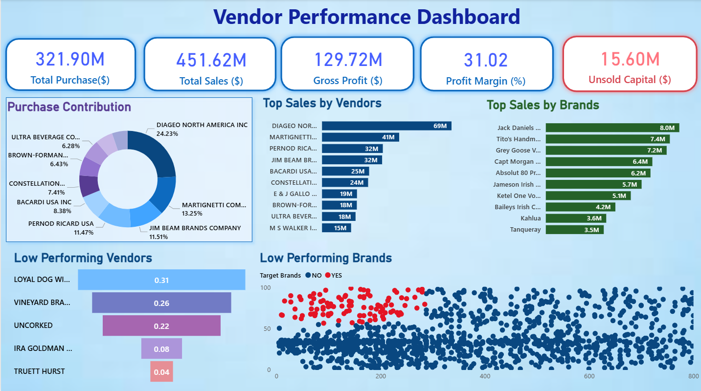

# 📦 Inventory & Vendor Performance Analysis

An end-to-end analytics pipeline built for a growing manufacturing business managing diverse product lines. This personal portfolio project demonstrates industry‑standard best practices in data ingestion, transformation, statistical analysis, and interactive dashboarding using anonymized transactional data.


---

## 📖 Overview

* **Domain:** Manufacturing company handling general products  
* **Data Scope:** Multi‑million‑row CSV files for inventory, purchases, sales, and vendor invoices  
* **Objective:**
  * Identify stock inefficiencies  
  * Reduce carrying costs  
  * Enhance vendor management  

---

## 🚀 Key Features

1. **📥 Data Ingestion & Audit Logging**
   * `Ingestion/ingestion_db.py` loads raw CSV files into a SQL database  
   * Detailed logs captured in `Logs/ingestion_db.log` for full traceability  

2. **🔄 Data Transformation & Modeling**
   * Combined SQL and Python workflows generate a clean, vendor‑level summary table  

3. **📊 Advanced Analytics & Statistical Testing**
   * Jupyter notebooks perform EDA, feature engineering, and hypothesis testing on profit margins, stock turnover, and unsold inventory  

4. **📈 Interactive Dashboarding**
   * Power BI report visualizes KPIs such as profit margins, stock‑to‑sales ratios, and reorder recommendations  
   * Includes dynamic charts, tables, and KPI cards  

5. **🗂️ Modular, Scalable Structure**
   * Clear separation of images, ingestion scripts, logs, and analysis notebooks  
   * Easy onboarding for new collaborators or future extensions  

---

## 📁 Project Structure

```plaintext
Dashboard/
│   images/
│   └── Dashboard_preview.png               # Power BI dashboard snapshot  
│   Vendor PerformanceDashboard.pbix        # Interactive Power BI file  

Ingestion/
│   ingestion_db.py                         # Script for loading raw data into DB  

Logs/
│   ingestion_db.log                        # ETL process logs  

Notebooks/
│   Vendor Performance Analysis.ipynb                      # Main EDA & insights  
│   Vendor Performance Analysis (Transformed).ipynb        # Data transformation & summary table  

.gitignore                                   # Files/folders ignored by Git  
README.md                                    # Project documentation (this file)  
requirements.txt                             # Python dependencies  
````

---

## 🛠️ Tech Stack & Dependencies

* **Python 3.x** — `pandas`, `numpy`, `SQLAlchemy`, `matplotlib`, `seaborn`, `scipy`, `statsmodels`
* **SQL** — PostgreSQL or SQLite
* **Jupyter Notebook** — Interactive data exploration
* **Power BI** — Dashboard creation & reporting
* **Logging** — Built‑in Python `logging` module

Refer to `requirements.txt` for exact package versions.

---

## ⚙️ Setup & Installation

1. **Clone the repository**

   ```bash
   git clone https://github.com/Saif907/vendor-performance-dashboard.git
   cd vendor-performance-dashboard
   ```

2. **Create & activate a virtual environment**

   ```bash
   python -m venv venv
   source venv/bin/activate      # macOS/Linux  
   venv\Scripts\activate         # Windows  
   ```

3. **Install dependencies**

   ```bash
   pip install -r requirements.txt
   ```

4. **Load raw data into the database**

   ```bash
   python Ingestion/ingestion_db.py
   ```

5. **Explore analysis notebooks**

   ```bash
   jupyter lab
   ```

   * `Vendor Performance Analysis.ipynb` → EDA & insights
   * `Vendor Performance Analysis (Transformed).ipynb` → Data transformation & summary table

6. **View the Power BI dashboard**
   Open Power BI Desktop and load `Dashboard/Vendor PerformanceDashboard.pbix`

---

## 📊 Dashboard Preview



---

## 🙋 Contact

**Prince Raj**
📧 [spunkyiitj@gmail.com](mailto: spunkyiitj@gmail.com)
🔗 [LinkedIn](https://www.linkedin.com/in/prince-rajiitj)

Feel free to explore the code and reach out with any questions or feedback!
